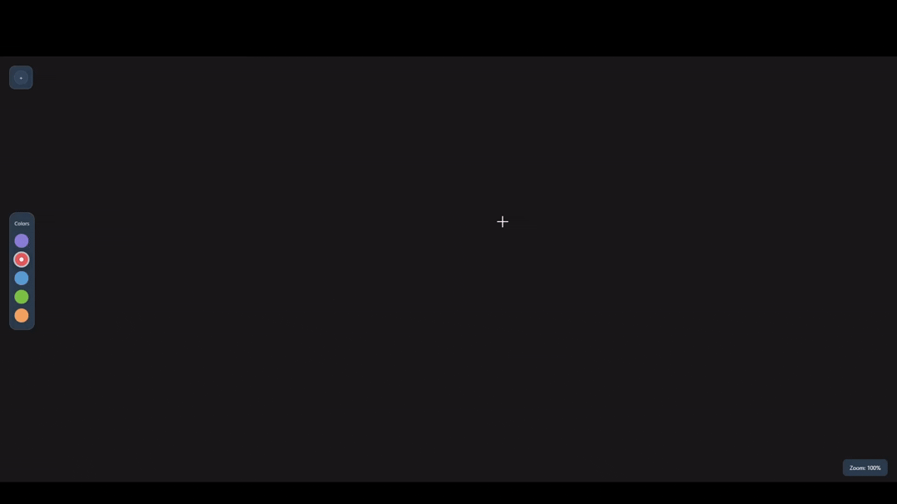

# EasyMap - Mind Maps Made Easy 🧠

Lightning-fast mind mapping with zero learning curve. Right-click to create, left-click to move, middle-click to delete. No menus, no complexity – just pure speed and efficiency for capturing your thoughts at the speed of thinking.


## Features

### Core Functionality
- **Drag & Drop Interface** - Intuitive bubble creation and movement
- **Smart Connections** - Connect ideas with curved, gradient lines
- **Real-time Editing** - Double-click any bubble to edit text inline
- **Zoom & Pan** - Smooth zooming with mouse wheel, automatic centering
- **Color Themes** - Built-in light and dark themes

### Advanced Features
- **Color-Coded Bubbles** - 5 different color schemes for categorizing ideas
- **Dynamic Resizing** - Scroll while dragging to resize bubbles
- **Line Types** - Toggle between solid and dotted connection lines
- **Smart Curves** - Automatic curve generation for natural-looking connections
- **Visual Feedback** - Hover effects, smooth animations, and visual indicators

### Export & Save
- **Local Storage** - Automatic saving to browser storage
- **JSON Export/Import** - Save and load complete mind maps
- **PNG Export** - High-quality image export for presentations
- **Cross-Session Persistence** - Your work stays safe between browser sessions

## Quick Start

1. **Clone the repository**
   ```bash
   git clone https://github.com/ullahs3/EasyMap---Mind-maps-made-easy.git
   cd EasyMap---Mind-maps-made-easy
   ```

2. **Open in browser**
   ```bash
   # Simply open index.html in any modern browser
   open index.html
   ```

3. **Start creating!**
   - Right-click anywhere to create your first bubble
   - Double-click to edit text
   - Drag bubbles around to organize your thoughts

## Controls & Shortcuts

### Mouse Controls
| Action | Control |
|--------|---------|
| **Create Bubble** | Right-click on empty space |
| **Move Bubble** | Left-click and drag |
| **Edit Text** | Double-click bubble |
| **Resize Bubble** | Scroll wheel while dragging |
| **Create Connection** | Right-click and hold, drag to another bubble |
| **Toggle Line Style** | Left-click while connecting |
| **Delete Bubble** | Middle-click on bubble |
| **Delete Connection** | Middle-click on connection line |
| **Zoom In/Out** | Scroll wheel |

### Interface Features
- **UI Panel**
- **Color Palette** - Left sidebar for quick color changes
- **Live Zoom Display** - Bottom-right corner shows current zoom level

## Project Structure

```
EasyMap/
├── index.html          # Main HTML structure
├── styles.css          # Complete styling and themes
├── script.js           # Mind map functionality
└── README.md           
```

### File Breakdown
- **`index.html`** - Clean semantic HTML with accessibility features
- **`styles.css`** - Modern CSS with custom properties, themes, and animations
- **`script.js`** - Vanilla JavaScript ES6+ with modular class architecture

## Themes & Customization

### Built-in Themes
- **Default Theme** - Purple gradients with clean white UI
- **Dark Theme** - Professional dark mode with blue-gray accents

### Color Schemes
- **Default Purple** 
- **Action Red** 
- **Info Blue** 
- **Success Green** 
- **Warning Yellow** 

## Technical Details

### Technologies Used
- **Pure Vanilla JavaScript** - No external dependencies
- **CSS3 Custom Properties** - Dynamic theming system
- **SVG Graphics** - Scalable connection lines with gradients
- **HTML5 Canvas** - High-quality PNG export functionality
- **Local Storage API** - Client-side data persistence

### Browser Support
- ✅ Chrome 80+
- ✅ Firefox 75+
- ✅ Safari 13+
- ✅ Edge 80+

### Performance Features
- **Optimized Rendering** - Smooth 60fps animations
- **Memory Efficient** - Clean event listener management
- **Responsive Design** - Works on desktop and tablet devices

## 📊 Use Cases

### Business & Professional
- **Project Planning** - Map out project phases and dependencies
- **Team Brainstorming** - Collaborative idea generation sessions
- **Problem Solving** - Break down complex problems visually
- **Strategic Planning** - Visualize business strategies and goals

### Education & Learning
- **Study Notes** - Organize complex topics and concepts
- **Research Planning** - Map research topics and sources
- **Presentation Prep** - Structure presentations and talks
- **Knowledge Management** - Create personal knowledge bases

### Personal Use
- **Life Planning** - Visualize personal goals and plans
- **Creative Writing** - Plot stories, characters, and themes
- **Decision Making** - Weigh pros and cons visually
- **Learning New Skills** - Break down learning paths


### Areas for Contribution
- Additional themes and color schemes
- Mobile touch support improvements
- New export formats (PDF, SVG)
- Internationalization (i18n)
- Enhanced accessibility features

## License

This project is licensed under the MIT License - see the [LICENSE](LICENSE) file for details.

## Acknowledgments

- Inspired by classic mind mapping techniques
- Built with modern web standards
- Designed for simplicity and power


**Made by Saif Ullah**

*Transform your thoughts into visual masterpieces* 
